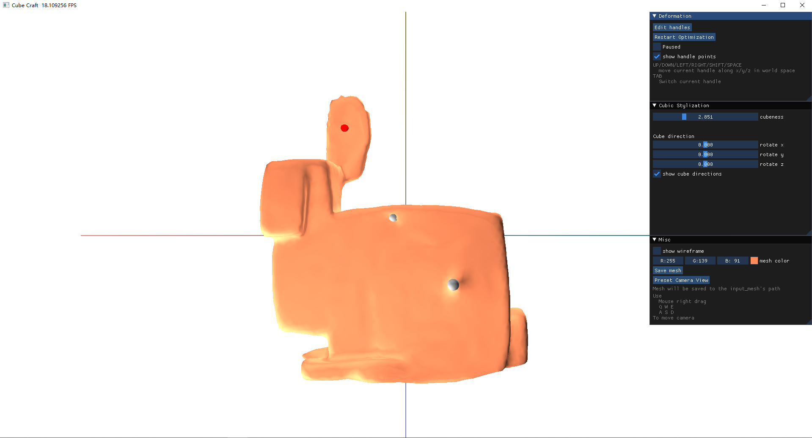

# CubeCraft: A Mesh Stylization Tool

A Taichi implementation of [Cubic Stylization [Liu, Jacobson, 2019]]("https://www.dgp.toronto.edu/projects/cubic-stylization/").


## Install and Execute
The code should support all platforms other than Mac M1 chip.

```bash
git clone https://github.com/haoda-li/CS284A-cubic-craft.git
cd CS284A-cubic-craft

pip install -r requirements.txt
cd main

# If you have a Mac or your computer does not have a GPU
# change gui_taichi.py line 6 
# from ti.init(arch=ti.gpu)
# to ti.init(arch=ti.cpu)
python gui_taichi.py [PATH TO MESH FILE]
```


## GUI Controls

- Use `Preset Camera View` to change to the axis-aligned camera view that you like. You can also press `w, s, a, d, e, q` to move the camera forward, back, left, right, head up, head down, accordingly. In addition, use the right mouse drag to change the camera's viewing angle. 

- Press `Enter deformation` button and `LEFT CLICK` the mesh to add new handle points. You can use `BACKSPACE` on your keyboard to delete currently selected handle point (red) and use `TAB` to switch to another handle point. By default, one handle is added to the first vertex because cubic stylization needs at least one constraint.

- Use `paused` checkbox to run and pause cubic stylization optimization. If the mesh is too large for real-time optimization, then use `Step` button to manually run one iteration of the optimization. 

- You can change the `cubeness` parameter to generate new mesh with different cubic-stylized extent.

- Rotate three axes to cubic stylize your mesh in different cube orientation.

- After adding at least two handle points, you can do experiments with as-rigid-as-possible deformation. Use keyboard `UP, DOWN, LEFT, RIGHT, SHIFT, SPACE` to move your selected handle point up, down, left, right, back, and forward __according to the world coordinate__. Use `TAB` to switch between handle points.

- Use `Save mesh` button to save your cubic-stylized mesh, the output mesh will be written to the same directory as the input mesh. 

