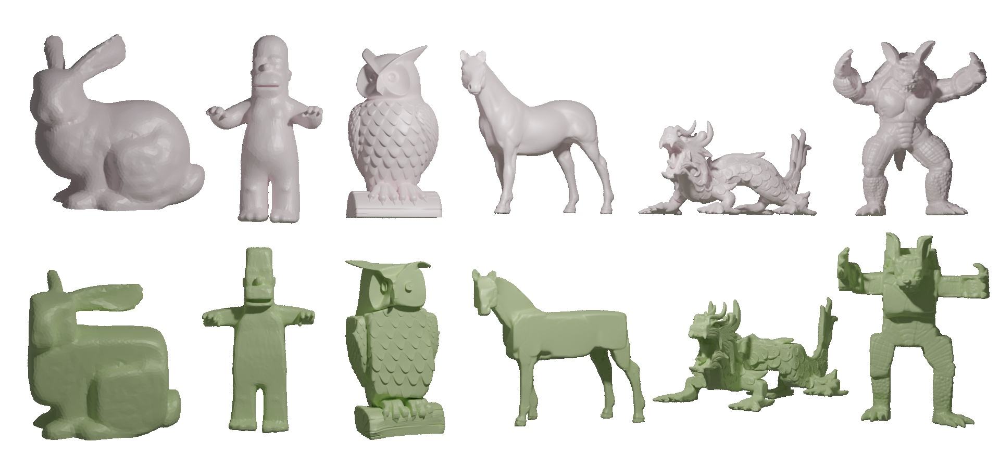
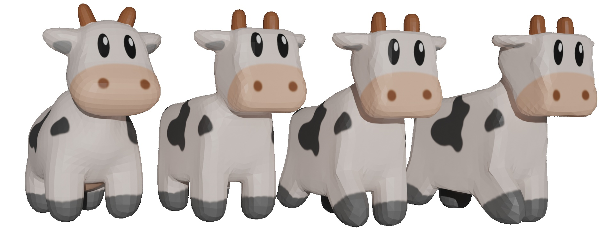
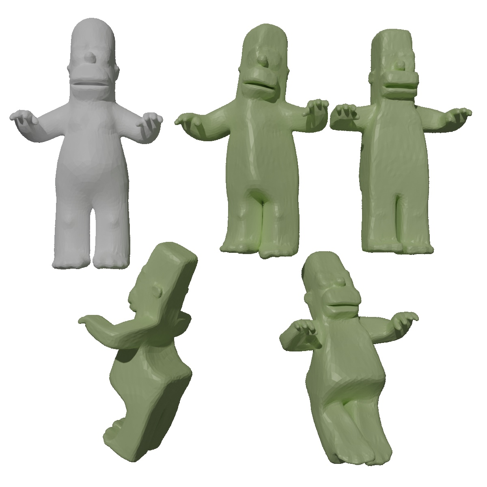
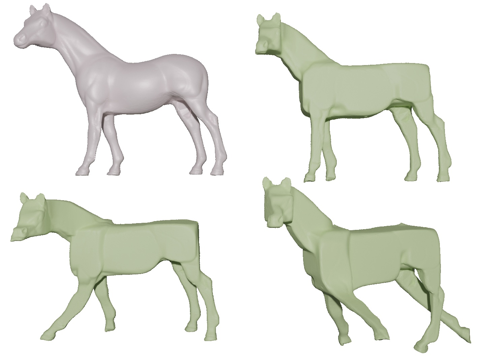

# Gallery

<figure markdown>
  { width="1080" }
  <figcaption>CubicCraft turns triangle meshes (grey) into cubic-styled meshes (green)</figcaption>
</figure>

<video width="1080" height="720" controls>
  <source src="/assets/gui_real_time.mp4" type="video/mp4">
</video>

<figure markdown>
  <figcaption>Our GUI, the user can view the mesh deformation progress and change parameters</figcaption>
</figure>

<figure markdown>
  { width="1080" }
  <figcaption>Shape deformation preserves vertex attributes</figcaption>
</figure>

<figure markdown>
  { width="1080" }
  <figcaption>Meshes with different cubeness, we saved our meshes and render them using Blender</figcaption>
</figure>

<figure markdown>
  { width="720" }
  <figcaption>Meshes with different cube orientation</figcaption>
</figure>

<figure markdown>
  { width="720" }
  <figcaption>CubicCraft is compatible with As-rigid-as-possible deformation</figcaption>
</figure>