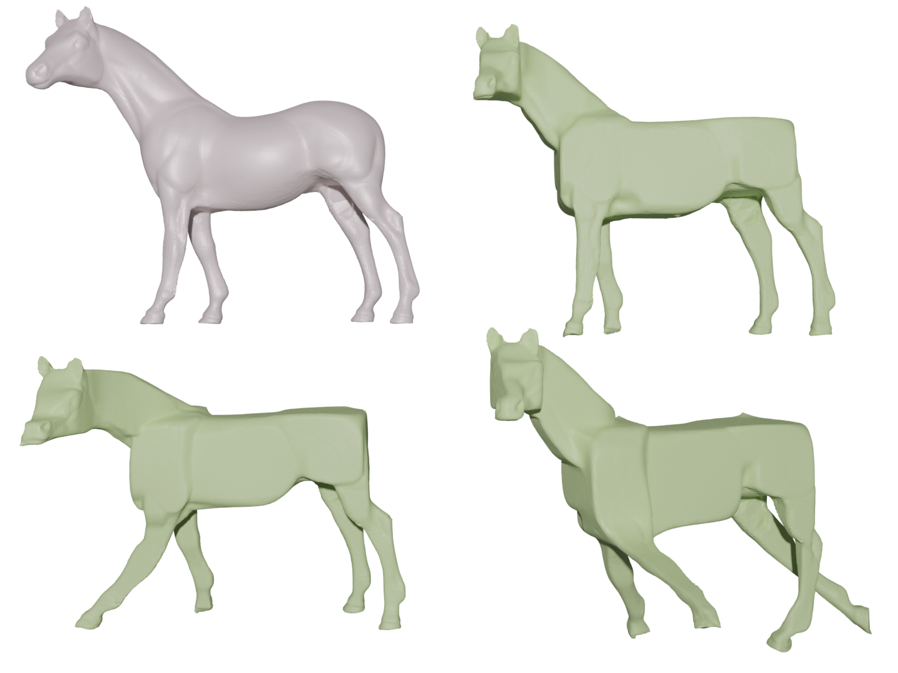

# Gallery

<figure markdown>
  { width="1080" }
  <figcaption>CubeCraft turns triangle meshes (grey) into cubic-styled meshes (green)</figcaption>
</figure>

<figure markdown>
  { width="720" }
  <figcaption>Our GUI, the user can view the mesh deformation progress and change parameters</figcaption>
</figure>

<figure markdown>
  { width="1080" }
  <figcaption>Meshes with different cubeness, we saved our meshes and render them using Blender</figcaption>
</figure>

<figure markdown>
  { width="720" }
  <figcaption>Meshes with different cube orientation</figcaption>
</figure>

<figure markdown>
  { width="720" }
  <figcaption>CubeCraft is compatible with As-rigid-as-possible deformation</figcaption>
</figure>