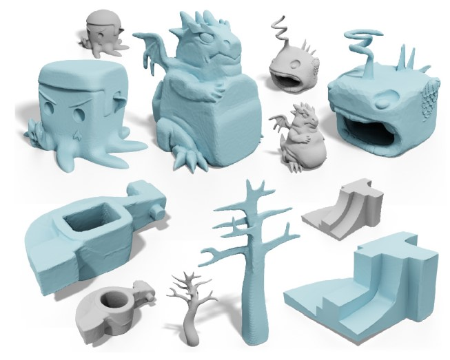

# Cubic Craft

[Haoda Li](https://github.com/haoda-li), 
[Puyuan Yi](https://github.com/JamesYi2953), 
[Victor Li](https://github.com/weiji-li), 
[Zhen Jiang](https://github.com/Jz1116), 

In this project, we present a stylization tool to automatically manipulate 3D objects into a cubic style. Our tool uses a cubic stylization algorithm [@cubic_style] to cubify the object while preserving the geometric details. With our tool, 3D artists can create Minecraft-styled objects with ease. 

<figure markdown>
  
  <figcaption>Demonstration figure from Cubic Stylization</figcaption>
</figure>

## Problem Description
Non-realistic modeling can provide a unique art style for animations and video games. One of the most popular area for non-realistic modeling is voxel art. The cube-like looking is very interesting and attractive. There are many 3D editing software that can converts arbitrary meshes to voxels. However, voxelization works on local scale and cannot convert the general geometric shape. In our project, we use a cubic stylization algorithm to stylize the object into a cubic shape. Therefore, the object have a cubic look. 

## Goals and Deliverables

### What we plan to deliver

The final demo will be an interactive GUI for editing and displaying objects. The GUI will provide sliders for tuning the parameters, including cube orientation, "cubeness", and voxel resolution. Because cubic stylization is based on ARAP energy, ARAP deformation comes for free. The user will also be able to set up handle points and deform the object by dragging the points. The GUI will be able to run in real time and show the object's deformation. In addition, we will have an offline voxel renderer to produce ray tracing based images. We won't expect the ray tracing rendering to be real time. 

We are interested in testing the numerical stability and convergence speed of the cubic stylization algorithm. Also, how creative can the cubic style be. 

### What we hope to deliver

If there are enough time, we are interested in accelerating the algorithm using GPU for more complex meshes. Alternatively, we want to implement mesh decimation so that we we can estimate a simplified mesh, perform cubic stylization, and recover the original mesh after convergence. 

In addition, we can allow more controls and creativity. For example, the "cubeness" can be axis-specific so that the final shape is a cuboid (3D rectangle) instead a right cube. Also, we can expand the algorithm to create other polygon shapes. 

## Schedule

### First week

### Second week

### Third week

### Fourth week

- Finish final deliverables, including project video, project webpage and final paper.

- Prepare for final demo, including making presentation slides and rehearsal for presentation.

- Code restructure, improve code readability.

## Resources
We will mainly use C++ for the implementation. Ideally, the code will be cross-platform, but we will mainly work and test on Windows. 

Here is a list of papers and libraries we will use
- [Cubic Stylization](https://arxiv.org/pdf/1910.02926.pdf) [@cubic_style] the algorithm we will use.
- [As-rigid-as-possible surface modeling](https://igl.ethz.ch/projects/ARAP/arap_web.pdf) [@arap] makes the deformation problem an energy minimization problem, and cubic stylization is augmented on ARAP energy. 
- [CGAL](https://www.cgal.org/)[@cgal] as the major software platform for CPU implementation. 
- [Eigen](https://eigen.tuxfamily.org/index.php?title=Main_Page) for linear algebra and sparse solver. 
- [ImGUI](https://github.com/ocornut/imgui) as the major platform for GUI. 
- [Taichi language](https://docs.taichi-lang.org/) [@hu2019taichi] If GPU optimization is possible, we can also implement cubic stylization as a Taichi kernel. 

## References
\bibliography