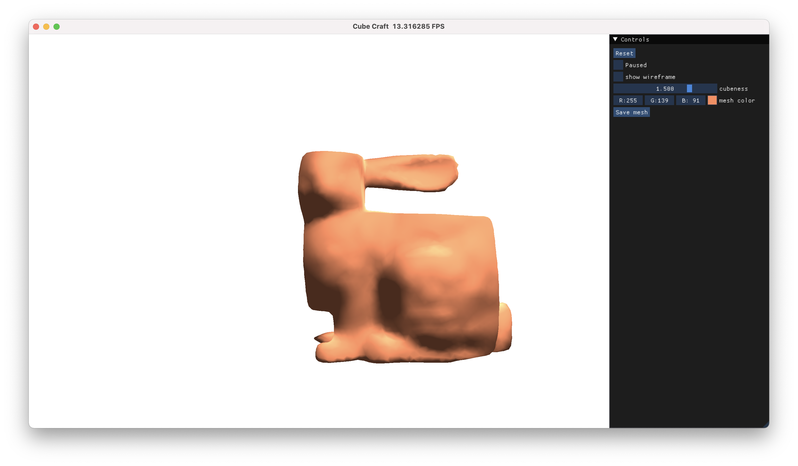
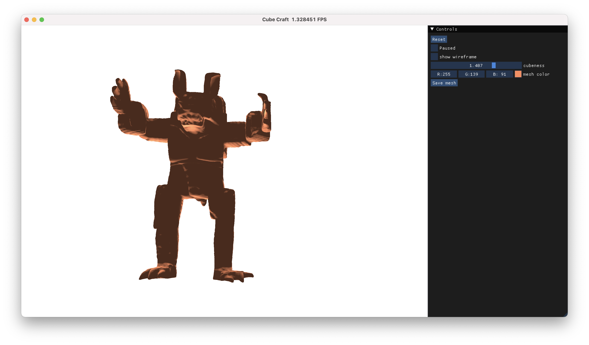
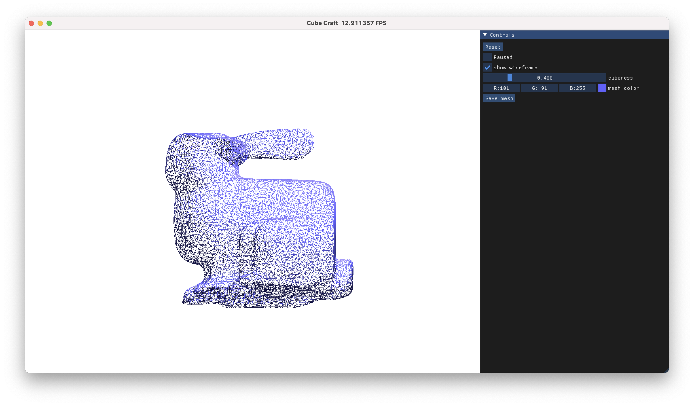

# Cubic Craft

[Haoda Li](https://github.com/haoda-li), 
[Puyuan Yi](https://github.com/JamesYi2953), 
[Victor Li](https://github.com/weiji-li), 
[Zhen Jiang](https://github.com/Jz1116), 

In this project, we present a stylization tool to automatically manipulate 3D objects into a cubic style. Our tool uses a cubic stylization algorithm [@cubic_style] to cubify the object while preserving the geometric details. With our tool, 3D artists can create Minecraft-styled objects with ease. 

 
*Photo of Minecraft-styled objects*

## External Links

- [Our slides](https://docs.google.com/presentation/d/12iifKoNhjGInhJqSMDu6pAhNFBX3i4AgdjXz3iN-nas/edit?usp=share_link)
- [Our video](https://drive.google.com/file/d/1zCyl1HJOp3MiYYKhZTIQK5oc2nY-kC44/view?usp=share_link)

## Current Progress

- We have successfully finished our base-line algorithm of CPU-based and GPU-based cubic stylization. The GPU implementation
is based on **Taichi**. Given a mesh, our cubic craft algorithm
 stylizes the object into a cubic shape. Therefore, the object have a cubic look. We did experiments based
 on several traditional meshes, such as bunny.obj and armadillo.obj. Here are the sample pictures for reference:

  
   
  *Photo of a Cubic Bunny*

  
   
  *Photo of a Cubic Armadillo*

- We have created a GUI for users to directly interact with our implemented cubic craft algorithm. This GUI provides sliders 
for tuning the parameters, including cube orientation and "cubeness". In addition, this GUI has lots of basic
graphic functions such as displaying wireframe and changing mesh's color. Here is the sample picture
for your reference:

  
   
  *In the picture, the GUI allows you to display wireframe, toggle cubeness, and change mesh color.*

## Future works

- Optimizing our user-friendly GUI. The cubic stylization algorithm has many hyperparameters that can be experimented with.
Currently our GUI just has the cubeness parameter.

- Building handle functions. Based on this functions, users will also be able to set up handle points and deform the object by dragging the points.

- Preparing for the final showcase. Creating the video, webpage and writing the final report.

## References
\bibliography