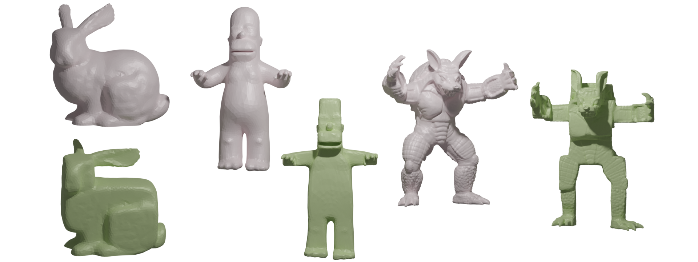
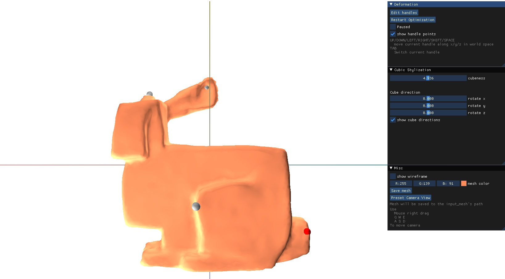
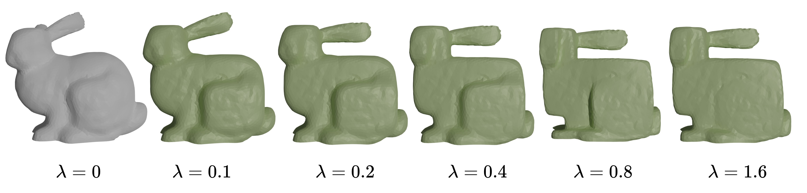
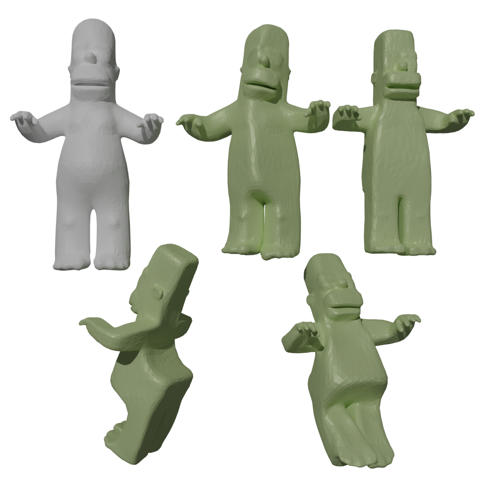

# Cubic Craft

[Haoda Li](https://github.com/haoda-li), 
[Puyuan Yi](https://github.com/JamesYi2953), 
[Victor Li](https://github.com/weiji-li), 
[Zhen Jiang](https://github.com/Jz1116), 


In this project, we present a stylization tool to automatically manipulate 3D objects into a cubic style. Our tool uses a cubic stylization algorithm [@cubic_style] to cubify the object while preserving the geometric details. With our tool, 3D artists can create Minecraft-styled objects with ease. 


<figure markdown>
  { width="1080" }
  <figcaption>Cubic Craft turns triangle meshes (grey) into cubic-styled meshes (green)</figcaption>
</figure>

## External Links
- [SIGGRAPH styled paper](./assets/cube_craft.pdf)
- [Our slides](https://docs.google.com/presentation/d/12iifKoNhjGInhJqSMDu6pAhNFBX3i4AgdjXz3iN-nas/edit?usp=share_link)
- [Our video](https://drive.google.com/file/d/1twuOx0lY_b68Wo-vGp0ecjrIopT-Xw2n/view?usp=share_link)
- [Our code](https://github.com/haoda-li/CS284A-cubic-craft)

## Install and Run

__We highly encourage you try our GUI__. It's based on Python and is very easy to install! The code should support all platforms other than Mac M1 chip.

```bash
git clone https://github.com/haoda-li/CS284A-cubic-craft.git
cd CS284A-cubic-craft

pip install taichi libigl
cd main

# If you have a Mac or your computer does not have a GPU
# change gui_taichi.py line 6 
# from ti.init(arch=ti.gpu)
# to ti.init(arch=ti.cpu)
python gui_taichi.py [PATH_TO_MESH_FILE]
```
## Current Progress

- We have successfully finished our base-line algorithm of CPU-based and GPU-based cubic stylization. The GPU implementation
is based on `libigl` and `Taichi`. Given a mesh, our cubic craft algorithm stylizes the object into a cubic shape. Therefore, the object have a cubic look.
- We provide a graphical interface for the users to visualize and easily edit the meshes. Given a triangle mesh, our graphical interface allows the user to change the parameters in the algorithm, visualize the deformations, and save the resulting mesh.
- In addition to the cubeness parameter, we notice that cube stylization is orientation dependent. The cubeness is achieved by forcing all vertex normals to align with the three standard axes. If we rotate the input mesh, the output shape will be different. Note that the same effect can be achieved by applying a coordinate transformation on all vertex normals. Therefore, we add the coordinate rotation parameters $(\theta, \phi)$ so that users can have different cube orientations.
- We did experiments based on several traditional meshes and here are some performance stats:
  
| mesh name | number of vertices | CPU time (s) | GPU time (s) |
| --- | --- | --- | --- |
| homer | 6002 | 16.03 | 1.77 |
| bunny | 6172 | 43.23 | 1.96 | 
| armadillo | 49990 | 370.64 | 7.49 |

## Future works
- Currently, the vertex index and positions are hard-coded. In the future, the users will be able to left-click the mesh and place constraints on the deformation. The users will also be able to drag the points to deform it in real time.
- Optimizing our user-friendly GUI. The cubic stylization algorithm has many hyperparameters that can be experimented with. Currently our GUI just has the uniform cubeness parameter and cube orientation.
- Preparing for the final showcase. Creating the video, webpage and writing the final report.

## Gallery
<figure markdown>
  { width="720" }
  <figcaption>Our GUI, the user can view the mesh deformation progress and change parameters</figcaption>
</figure>

<figure markdown>
  { width="1080" }
  <figcaption>Meshes with different cubeness, we saved our meshes and render them using Blender</figcaption>
</figure>

<figure markdown>
  { width="720" }
  <figcaption>Meshes with different cube orientation</figcaption>
</figure>
## References
\bibliography